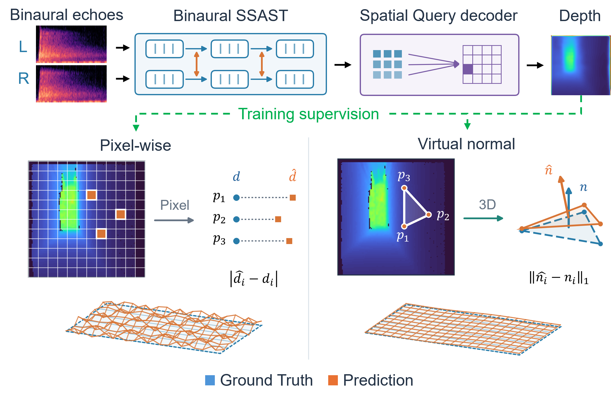
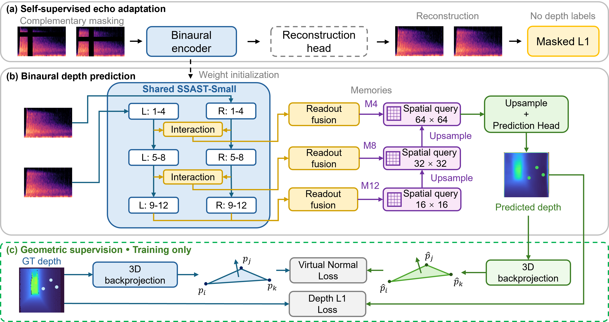

# EchoGeom

This repository currently provides inference and evaluation code for EchoGeom,
together with pretrained model weights. These resources support demonstration
and evaluation of the method; the full research pipeline is outside the scope
of the current release.

## Overview

<p align="center">
  
</p>

<br>

## Method

<p align="center">
  
</p>

## Installation

Tested on Linux with Python 3.10 and PyTorch 2.4.1. Run from this directory:

```bash
python3.10 -m venv .venv
source .venv/bin/activate
python -m pip install torch==2.4.1 torchaudio==2.4.1 torchvision==0.19.1 --index-url https://download.pytorch.org/whl/cu118
python -m pip install -r requirements.txt
```

For CPU, replace `cu118` with `cpu` in the install command.

## Checkpoint

Download the checkpoint from [Google Drive](https://drive.google.com/drive/folders/10zAmL_fwVpgWU9Cq7XPBEHQ2RkAkJAkv?usp=drive_link)
into a local `weights/` folder. Set `paths.checkpoint` in [config.yaml](config.yaml)
to the downloaded file path.

Check the environment and checkpoint:

```bash
python check_environment.py --device cpu
```

## Evaluation

Download [BatVision V2](https://github.com/amandinebtto/Batvision-Dataset)
and keep the official directory structure:

```text
BV2/
  Attic/
    test.csv
    val.csv
    audio/
    depth/
  ...
```

```bash
python test.py --data-root /path/to/BV2
```

Depth and normal metrics are saved to `results/bv2_test.json`.
Use `--no-normals` for depth metrics only, or `--split val` for validation.

## Inference

```bash
python infer.py --audio /path/to/stereo.wav
```

Input: stereo WAV at 44.1 kHz. Approximately the first 0.176 seconds are used.
Output: `results/depth.npy`, a 128 × 128 depth map in meters.

Both scripts read [config.yaml](config.yaml); CLI arguments override it.
Set `paths.data_root` or `paths.audio` there to run without path arguments.
YAML paths are relative to this directory; CLI paths are relative to the working
directory. Model architecture settings must match the checkpoint.
Use `--device cpu` or `--output /path/to/output` as needed.

## Research use

Original EchoGeom material is provided for noncommercial research and education.
Commercial use requires separate permission.
Third-party code: [SSAST](https://github.com/YuanGongND/ssast) (BSD 3-Clause) and
[timm/DeiT](https://github.com/huggingface/pytorch-image-models/tree/v0.4.5)
(Apache 2.0). Their license texts are retained in [licenses/](licenses/).
Please cite EchoGeom, SSAST, and BatVision V2. The EchoGeom citation will be added
when available.
